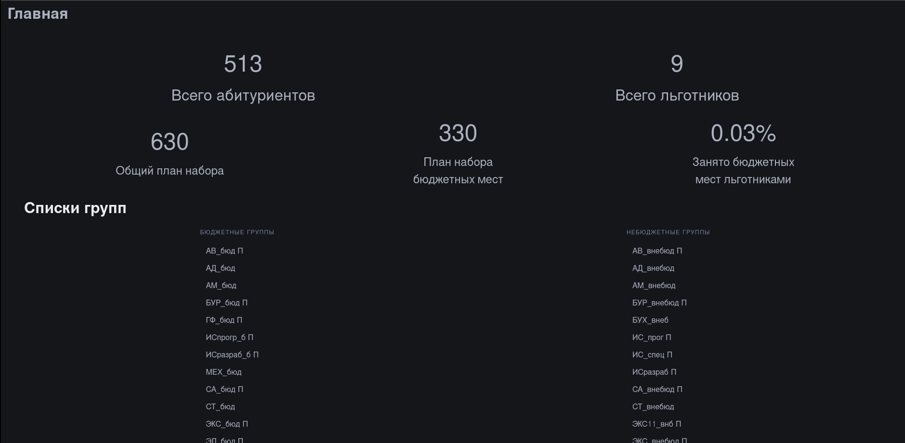
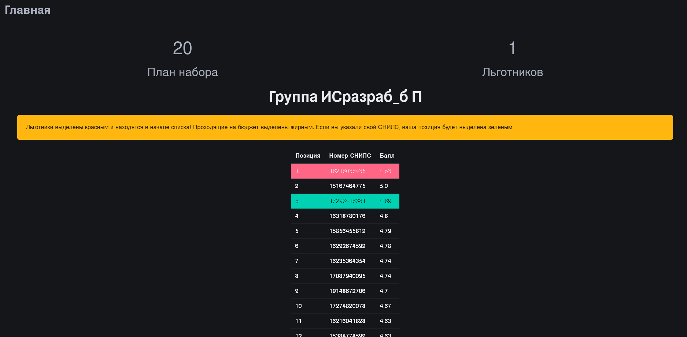

# apt-tracker

Переработанная версия [apt-enrollees](https://github.com/mrtstg/apt-enrollees/). 
Теперь на SSR, с общей статистикой и расчетом прохода на бюджетное место!

## Стек

- Python
- FastAPI - серверная часть
- Jinja2 - отрисовка шаблонов
- Redis - кэширование

## Общий принцип работы

Эксплуатация публичных эндпоинтов сайта, отдающих "грязную" и трудночитаемую информацию, кэширование данных для снижения
нагрузки сайта и предоставление данных в сортированном формате.

## Конфигурация

Сервер использует переменные окружения REDIS_HOST и REDIS_PORT для подключения к Redis. Стандартные параметры - localhost и 6379.

## Скриншоты

